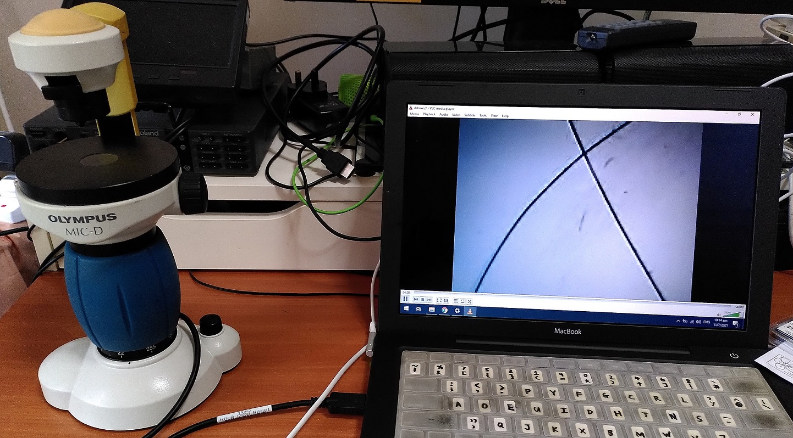
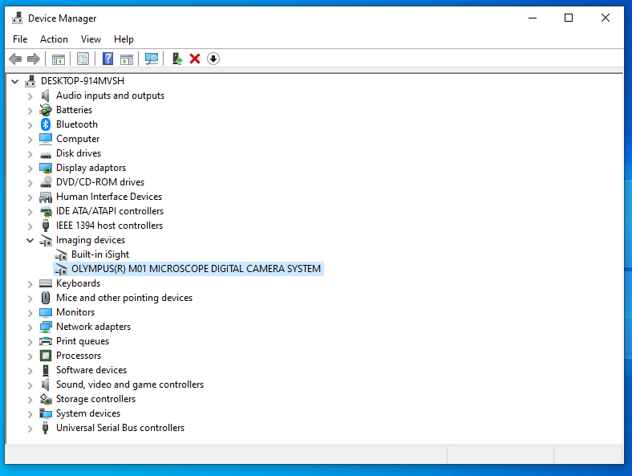

# Olympus-mic-d
Contains the driver CD data documents related to the Olympus Mic-D digital microscope.

## Contents

* install-disc: Installation CD including drivers
* olympus-mic-d-repair-manual.pdf: Obtained from http://www.alanwood.net/downloads/olympus-mic-d-repair-manual.pdf

## Driver details

Provided driver from the CD is 32-bit hence it will only work on 32-bit Windows. 

It has been tested on 32-bit Windows 10. Simply install through Device Manager.

A video player like VLC can then be used to open the Capture Device.
